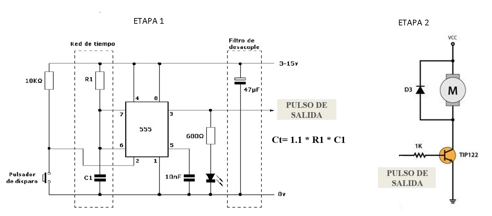

# Actuadores

# :trophy: A.2.2 Actividad de aprendizaje

 Realizar un sistema de control de arranque y encendido para un actuador eléctrico a través de un circuito electrónico, utilizando un simulador, un **Temporizador NE55s** y un **Motor de DC**.


### :blue_book: Instrucciones

- Se sugiere para el desarrollado de la presenta actividad, utilice uno de los siguientes simuladores: [Autodesk Tinkercad](https://www.tinkercad.com/), [Virtual BreadBoard](http://www.virtualbreadboard.com/), [Easy EDA](https://easyeda.com/) por lo cual habrá que familiarizarse antes, e incluso instalarse o registrarse dentro de la plataforma.
- Toda actividad o reto se deberá realizar utilizando el estilo **MarkDown con extension .md** y el entorno de desarrollo VSCode, debiendo ser elaborado como un documento **single page**, es decir si el documento cuanta con imágenes, enlaces o cualquier documento externo debe ser accedido desde etiquetas y enlaces, y debe ser nombrado con la nomenclatura **A2.2_NombreApellido_Equipo.pdf.**
- Es requisito que el .md contenga una etiqueta del enlace al repositorio de su documento en GITHUB, por ejemplo **Enlace a mi GitHub** y al concluir el reto se deberá subir a github.
- Desde el archivo **.md** exporte un archivo **.pdf** que deberá subirse a classroom dentro de su apartado correspondiente, sirviendo como evidencia de su entrega, ya que siendo la plataforma **oficial** aquí se recibirá la calificación de su actividad.
- Considerando que el archivo .PDF, el cual fue obtenido desde archivo .MD, ambos deben ser idénticos.
- Su repositorio ademas de que debe contar con un archivo **readme**.md dentro de su directorio raíz, con la información como datos del estudiante, equipo de trabajo, materia, carrera, datos del asesor, e incluso logotipo o imágenes, debe tener un apartado de contenidos o indice, los cuales realmente son ligas o **enlaces a sus documentos .md**, _evite utilizar texto_ para indicar enlaces internos o externo.
- Se propone una estructura tal como esta indicada abajo, sin embargo puede utilizarse cualquier otra que le apoye para organizar su repositorio.
  
```
- readme.md
  - blog
    - C2.1_x.md
    - C2.2_x.md
  - img
  - docs
    - A2.1_x.md
    - A2.2_x.md
```
### :pencil2: Desarrollo

1.Utilice el siguiente listado de materiales para la elaboración de la actividad

| Cantidad | Descripción                            |
| -------- | -------------------------------------- |
| 1        | Circuito integrado LM555       [**Mecatronica**](https://www.mecatronicalatam.com/es/tutoriales/electronica/componentes-electronicos/555/)          |
| 1        | Capacitor electrolítico de 47uf  [**Tostatronic**](https://tostatronic.com/store/es/componentes-pasivos/854-capacitor-electrolitico-47uf-50v.html)      |
| 1        | Condensador cerámico de 10nf        [**Geekbotelectronics**](http://www.geekbotelectronics.com/producto/capacitor-ceramico-10-nf-50-v/)   |
| 1        | Fuente de voltaje de 9V             [**Sando**](https://sandorobotics.com/producto/hr0177-12/)   |
| 1        | Transistor de poder TIP122           [**Sando**](https://sandorobotics.com/producto/tip122/)  |
| 1        | Diodo 1N4001 o equivalente            [**330Ohms**](https://www.330ohms.com/products/diodo-rectificador-1n4001) |
| 1        | Mini Motor DC                          [**Steren**](https://www.steren.com.mx/mini-motor-de-corriente-directa.html)|
| 3        | Resistencias 680,1k,10k Ohmios de 1/4w [**Steren**](https://www.steren.com.mx/proyectos-de-electronica/potenciometros-y-resistencias)|
| 1        | Pulsador de disparo                   [**Diario Electronico**](https://www.diarioelectronicohoy.com/blog/pulsadores-sin-rebotes) |
| 1        | Diodo Led Rojo                      [**Geekbotelectronics**](http://www.geekbotelectronics.com/producto/led-difuso-rojo-5-mm/)   |

1. Utilice el circuito electrónico de la imagen siguiente y ensamble la etapa 1 dentro del simulador.

<p align="center">
    
</p>

:rotating_light: [**CIRCUITO Etapa 1 y Etapa 2**](https://www.tinkercad.com/things/8vBtcu5VQ8N-fabulous-jarv/editel?sharecode=I_n_7LdxxziqMZImxdTuF3ch_FGQA0iOCl5rhlbb30Y&fbclid=IwAR0mjH38uy6I9ojf_nECcA1DtHR02QzIA3NFgDYhxj9udAdllA43nJBn8tg) 

2. Como se podrá observar en el circuito anterior existe un area identificada como "Red de tiempo" y otra "Filtro de desacople", **explique el proposito de ambos terminologias**. 

**- Red de tiempo:** Este se utiliza para establecer el tiempo de encendido del pulso de salida.

**- Filtro de desacople:** Este se utiliza un condensador de 47uf para evitar la aparicion de ruido que pudiera afectar los niveles de umbral, y de disparo.

3. Continuando con la imagen anterior, observe se muestra la ecuación Ct= 1.1 * R1 * C1, la cual es utilizada para establecer el tiempo de **encendido del pulso de salida**. Basándose en esa ecuación anterior calcule los valores de **R1 y C1** si se desea mantener encendido el pulso de salida, dada las 3 condiciones requeridas en la tabla anexa.

    | Numero | Condición  | Valor de R1 | Valor de C1 |
    | ------ | ---------- | ----------- | ----------- |
    | 1      | 3 segundos |     58 kohm |  47µF         |
    | 2      | 5 segundos |    96kohm         |      47µF       |
    | 3      | 8 segundos |    154kohm        |          47µF   |


  **Operaciones:**  

---    
**3 segundos**

```
Resistencia exacta 

    R = 3s / (1.1 * 0.000047 F) 
    R = 58,027 ohms   

Resistencia comercial cercana

  56komh + 2kohm = 58kohm 

Tiempo Calculado

  Ct= 1.1 * 58,000ohm * 0.000047F = 2.998s 
```
**5 segundos**  

```
Resistencia exacta  

    R = 5s / (1.1 * 0.000047 F)
    R = 96,711 ohms 

Resistencia comercial cercana 

    82komh + 15kohm = 97kohm

Tiempo Calculado  

    Ct= 1.1 * 97,000ohm * 0.000047F = 5.014s
```

**8 segundos**  
  
```
Resistencia exacta

    R = 8s / (1.1 * 0.000047 F)
    R = 154,738 ohm

Resistencia comercial cercana 

    150komh + 5kohm = 155kohm

Tiempo Calculado  

    Ct= 1.1 * 155,000ohm * 0.000047F = 8.013s
```
----

4. Una vez que se halla completado la tabla anterior, inicie la simulación para cualquiera de las tres condiciones y observe el comportamiento del Led;  **explique su observación**.

**Respuesta** 

El LED se enciende dependiendo la condicion que se le ponga (ya sean 3, 5 u 8 segundos), al cumplirse dicho tiempo el LED se apaga y al presionar el boton, el LED vuelve a encenderse por el tiempo de la condicion dada.

5. Ensamble la etapa 2 e integre la terminal del pulso de salida a la entrada de la base del transistor de esta segunda etapa.
<p align="center">
    
</p>

6. Una vez concluido el paso anterior, elija una de las 3 condiciones registradas en la tabla anterior y observe el comportamiento del motor DC; **explique su observación**.

**Respuesta** 

En el motor sucede exactamente lo mismo que el LED, este enciende el mismo tiempo de acuerdo a la condicion a la que este y al cumplirse el tiempo este se apaga, pero al presionar al boton, este vuelve a encender dependiendo el tiempo de la condicion dada, esto gracias a la funcion del pulso de salida del 555.

7. Una vez que el tiempo de encendido del pulso de salida de la etapa 1 se completo, **que sucede con el motor DC? Explique la razon de este comportamiento?**

**Respuesta** 

Este al igual que el led, se apaga debido a que termino el tiempo que la etapa 1 proporciono corriente al transistor.


8. Inserte imágenes de evidencias tales como son reuniones de los integrantes del equipo realizadas para el desarrollo de la actividad.
<p align="center">
    
</p>
<p align="center">
    
</p>
<p align="center">
    
</p>

9.  Incluya las **conclusiones** individuales y resultados observados durante el desarrollo de la actividad.

- **Hernández Quezada Martín**

En esta actividad observamos la interacción entre 2 etapas en el circuito, donde el LM555 compartía corriente entre estas 2 etapas haciendo que el LED y el Motor encendieran dependiendo de la condición que le diéramos en la simulación. Y aunque al principio no le entendíamos muy bien y el circuito se nos complico un poco, gracias al profesor nos dimos cuenta que no funcionaba del todo nuestra forma de trabajar, ya que no todos estábamos familiarizados con el circuito y por ende no lo comprendíamos del todo, pero después de realizar las correcciones que presentamos en nuestro avance y trabajar juntos en el circuito, logramos terminar el circuito con éxito y con una nueva forma de trabajar en equipo, la cual es mas eficiente para todos. 

- **Navarro Rosas Martín Ivan**

En Conclusión se puede decir que el circuito integrado 555(temporizador) es muy versátil debido a que puede ponerse a trabajar con un rango muy amplio de frecuencias ,en cuanto al circuito realizado en esta práctica podemos decir que la red de tiempo nos permite configurar el tiempo de encendido del timer en si, y con la red de desacople se hace una excitación por medio de la terminal de descarga , que permite que el mini motor de corriente continua sea encendido y por lo tanto comience a rotar.

- **Sandoval Gorgonio Juan Pablo** 

Lo que entendí de esta práctica es que este circuito se puede usar para las maquinas de producción que al momento de estar en producción se mantiene encendido el led para indicar que está en funcionamiento. Se nos dificultó realizar esta práctica, el propósito de este fue crear una red para controlar cuanto tiempo funcionará el motor y a su vez el led se mantenga encendido cuando el motor este en funcionamiento.

### :bomb: Rubrica

| Criterios     | Descripción                                                                                  | Puntaje |
| ------------- | -------------------------------------------------------------------------------------------- | ------- |
| Instrucciones | Se cumple con cada uno de los puntos indicados dentro del apartado Instrucciones?            | 10      |
| Desarrollo    | Se respondió a cada uno de los puntos solicitados dentro del desarrollo de la actividad?     | 60      |
| Demostración  | El alumno se presenta durante la explicación de la funcionalidad de la actividad?            | 20      |
| Conclusiones  | Se incluye una opinión personal de la actividad  por cada uno de los integrantes del equipo? | 10      |

**Repositorios**

:house: [**Repositorio - HERNANDEZ QUEZADA MARTIN**](https://github.com/MartinHQ23/SistemasProgramables)

:house: [**Repositorio - NAVARRO ROSAS MARTIN IVAN**](https://github.com/MartinNavarro17/REPOSITORIO-SISTEMAS-PROGRAMABLES)

:house: [**Repositorio - SANDOVAL GORGONIO JUAN PABLO**](https://github.com/JuanPSG/SistemasProgramables)