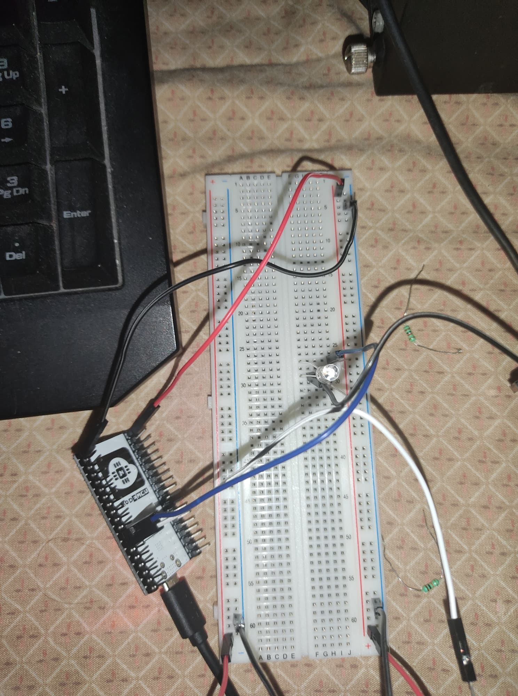
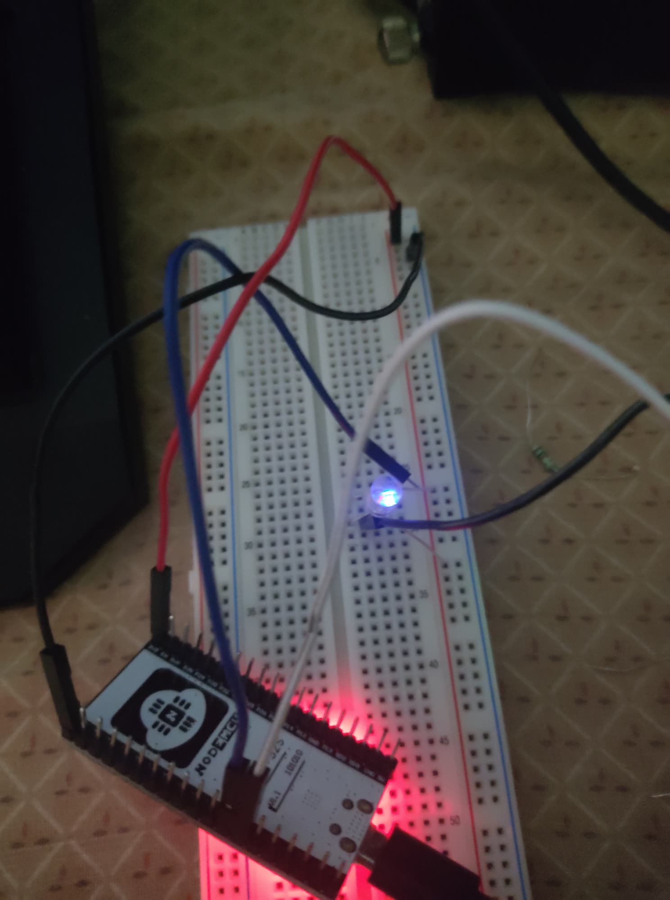
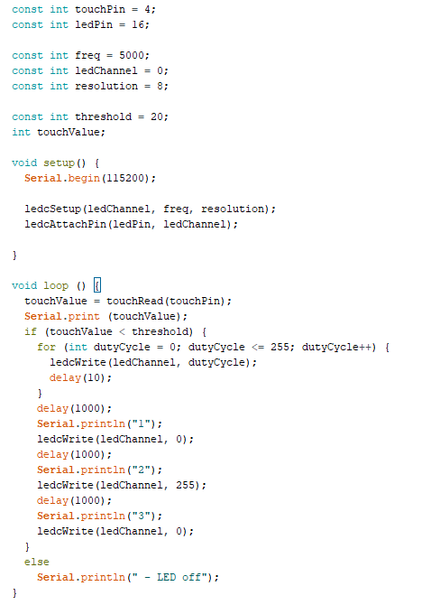
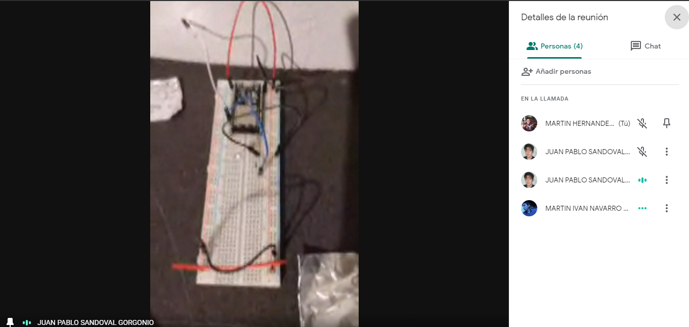
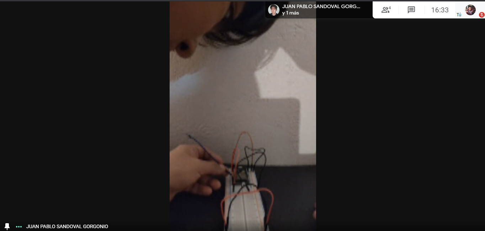
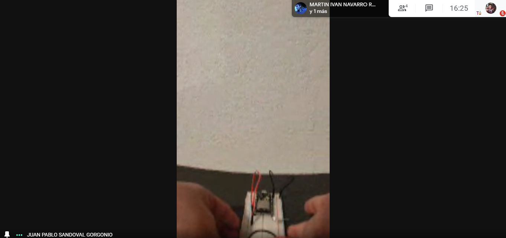
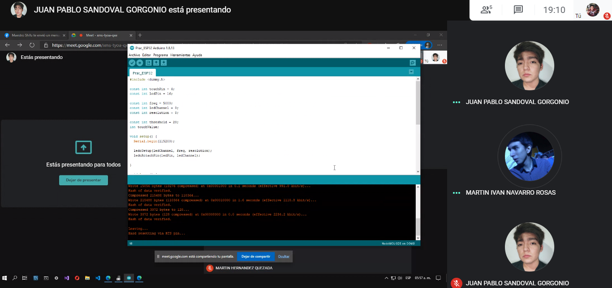
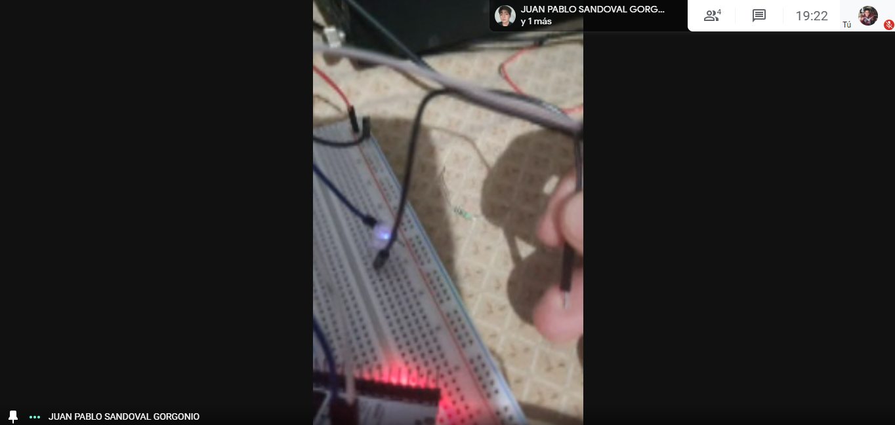

# :trophy: A.3.2 Actividad de aprendizaje

Circuito sensor de tacto a través de un NodeMCU ESP32
___

## Instrucciones

- Basado en la figura 1, ensamblar un sistema, capaz de responder al tacto, a través de un circuito electrónico, utilizando un NodeMCU **ESP32**, un  **Sensor de tacto capacitivo**.
- Toda actividad o reto se deberá realizar utilizando el estilo **MarkDown con extension .md** y el entorno de desarrollo VSCode, debiendo ser elaborado como un documento **single page**, es decir si el documento cuanta con imágenes, enlaces o cualquier documento externo debe ser accedido desde etiquetas y enlaces, y debe ser nombrado con la nomenclatura **A3.2_NombreApellido_Equipo.pdf.**
- Es requisito que el .md contenga una etiqueta del enlace al repositorio de su documento en GITHUB, por ejemplo **Enlace a mi GitHub** y al concluir el reto se deberá subir a github.
- Desde el archivo **.md** exporte un archivo **.pdf** que deberá subirse a classroom dentro de su apartado correspondiente, sirviendo como evidencia de su entrega, ya que siendo la plataforma **oficial** aquí se recibirá la calificación de su actividad.
- Considerando que el archivo .PDF, el cual fue obtenido desde archivo .MD, ambos deben ser idénticos.
- Su repositorio ademas de que debe contar con un archivo **readme**.md dentro de su directorio raíz, con la información como datos del estudiante, equipo de trabajo, materia, carrera, datos del asesor, e incluso logotipo o imágenes, debe tener un apartado de contenidos o indice, los cuales realmente son ligas o **enlaces a sus documentos .md**, _evite utilizar texto_ para indicar enlaces internos o externo.
- Se propone una estructura tal como esta indicada abajo, sin embargo puede utilizarse cualquier otra que le apoye para organizar su repositorio.
  
```
- readme.md
  - blog
    - C3.1_TituloActividad.md
    - C3.2_TituloActividad.md
    - C3.3_TituloActividad.md
    - C3.4_TituloActividad.md
    - C3.5_TituloActividad.md
    - C3.6_TituloActividad.md
    - C3.7_TituloActividad.md
    - C3.8_TituloActividad.md
  - img
  - docs
    - A3.1_TituloActividad.md
    - A3.2_TituloActividad.md
    - A3.3_TituloActividad.md
```
___

### Fuentes de apoyo para desarrollar la actividad

- [x] [Sensor de tacto capacitivo](https://randomnerdtutorials.com/esp32-touch-pins-arduino-ide/)
- [x] [Salida analogica PWM](https://randomnerdtutorials.com/esp32-pwm-arduino-ide/)

___

## Desarrollo

1.Utilice el siguiente listado de materiales para la elaboración de la actividad

| Cantidad | Descripción                                                                                                                                                                                                                |
| -------- | -------------------------------------------------------------------------------------------------------------------------------------------------------------------------------------------------------------------------- |
| 1        | [Diodo led Rojo](https://www.steren.com.mx/led-ultrabrillante-de-5-mm-color-rojo.html)                                                                                                                                                                                           | 
| 1        | [Resistencia 330 ohms](http://www.geekbotelectronics.com/producto/resistencia-330-ohm-14-w/)                                                                                                                                                                                                        |
| 1        | [Fuente de voltaje de 5V](https://www.yescomusa.com/products/30v-precision-variable-voltage-power-supply-dc-converter)                                                                                                                                                                                                    |
| 1        | [NodeMCU ESP32](https://www.amazon.com.mx/ESP-32-ESP-32S-ESP-WROOM-32-ESP32-S-desarrollo/dp/B07TBFC75Z/ref=sr_1_2?__mk_es_MX=%C3%85M%C3%85%C5%BD%C3%95%C3%91&dchild=1&keywords=esp32&qid=1599003438&sr=8-2)                |
| 1        | [BreadBoard](https://www.amazon.com.mx/Deke-Home-Breadboard-distribuci%C3%B3n-electr%C3%B3nica/dp/B086C9HK7V/ref=sr_1_22?__mk_es_MX=%C3%85M%C3%85%C5%BD%C3%95%C3%91&dchild=1&keywords=breadboard&qid=1599003455&sr=8-22)   |
| 1        | [Jumpers M/M](https://www.amazon.com.mx/ELEGOO-Macho-Hembra-Macho-Macho-Hembra-Hembra-Protoboard/dp/B06ZXSQ5WG/ref=sr_1_1?__mk_es_MX=%C3%85M%C3%85%C5%BD%C3%95%C3%91&dchild=1&keywords=jumper+wires&qid=1599003519&sr=8-1) |
| 1        | Hoja de aluminio                                                                                                                                        
<p align="center"> 
    <strong>Figura 1 Circuito ESP32 IC L293 Motor DC</strong>
    
</p>

2. Una vez ensamblado el circuito anterior, realice un programa que permita al ensamble cumplir con las siguientes condiciones:
    - El sistema deberá ser capaz de encender y apagar **un led** al presionar el sensor de tacto.
    - El sistema deberá tener la característica que si el Led esta encendido, al tocar el sensor de tacto, este iniciara un secuencia de intermitencia de 3 segundos (es decir se apaga 1 segundo, se enciende un segundo y se apaga finalmente).
    - El sistema deberá contar con la característica que si el Led esta apagado, al tocar el sensor de tacto, este se encenderá poco a poco hasta llegar a su nivel máximo de iluminación.
3. Coloque aquí evidencias que considere importantes durante el desarrollo de la actividad.

**Circuito**
<p align="center"> 
    
</p>

<p align="center"> 
    
</p>

**Codigo**

<p align="center"> 
    
</p>

**Evidencias**
<p align="center"> 
    
</p>

<p align="center"> 
    
</p>

<p align="center"> 
    
</p>

<p align="center"> 
    
</p>

<p align="center"> 
    
</p>

4. Incluya las **conclusiones** individuales y resultados observados durante el desarrollo de la actividad.

- **Hernández Quezada Martín**

Esta actividad tuvo un poco mas de dificultad debido a que no se logro conseguir la placa ESP-32 en tiempo, sin embargo después de conseguirla, se pudo terminar el circuito donde se demostró que gracias al PWM logramos hacer que nuestro LED encienda y apague, esto gracias a la codificación y librerías, que aunque al principio tuvimos un pequeño percance al tratar de hacer la intermitencia al tocar el sensor, se pudo realizar y terminar la practica en tiempo.  

- **Navarro Rosas Martín Ivan**

El esp32 puede tener un uso bastante amplio, en conclusión para esta practica se demostró que el ESP es bastante útil con el manejo de PMW ya que se utilizo para que el led encendiera lentamente asi como para que encendiera y prendiera de manera intermitente, esta intermitencia se produce debido al codigo realizado en el que al tocar el sensor touch, que por cierto este microcontrolador tiene, este se enciende y posteriormente inicia una secuencia de apagado que en este caso es una intermitencia , pero este microcontrolador puede ser bastante util debido a sus usos y multiples funciones con las que cuenta el ESP 32.

- **Sandoval Gorgonio Juan Pablo** 

Al realizar esta actividad pude entender como funciona un esp32 , en este circuito el LED parpadea por unos segundos y se apaga hasta volver a tocar el touch. Este puede ser útil en maquinarias industriales o en proyectos pequeños de robótica.
___

### :bomb: Rubrica

| Criterios     | Descripción                                                                                  | Puntaje |
| ------------- | -------------------------------------------------------------------------------------------- | ------- |
| Instrucciones | Se cumple con cada uno de los puntos indicados dentro del apartado Instrucciones?            | 10      |
| Desarrollo    | Se respondió a cada uno de los puntos solicitados dentro del desarrollo de la actividad?     | 60      |
| Demostración  | El alumno se presenta durante la explicación de la funcionalidad de la actividad?            | 20      |
| Conclusiones  | Se incluye una opinión personal de la actividad  por cada uno de los integrantes del equipo? | 10      |

**Repositorios**

:house: [**Repositorio - HERNANDEZ QUEZADA MARTIN**](https://github.com/MartinHQ23/SistemasProgramables)

:house: [**Repositorio - NAVARRO ROSAS MARTIN IVAN**](https://github.com/MartinNavarro17/REPOSITORIO-SISTEMAS-PROGRAMABLES)

:house: [**Repositorio - SANDOVAL GORGONIO JUAN PABLO**](https://github.com/JuanPSG/SistemasProgramables)