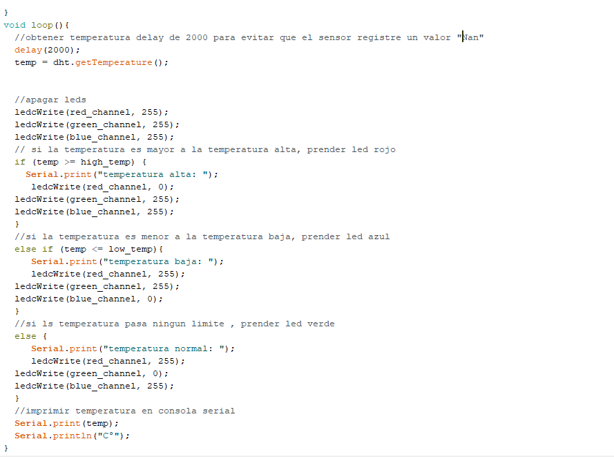
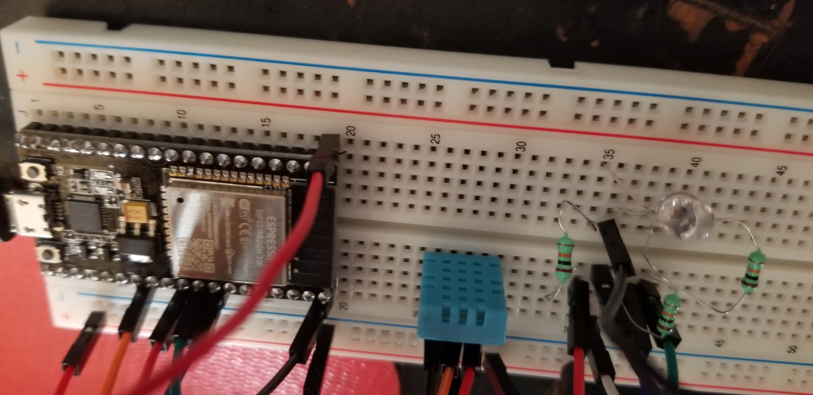

# :trophy: A.3.3 Actividad de aprendizaje

Circuito de medición de temperatura a través de un NodeMCU ESP32
___

## Instrucciones

- Basado en la figura 1, ensamblar un sistema, capaz de detectar la temperatura y humedad del ambiente, a través de un circuito electrónico, utilizando un NodeMCU **ESP32**, y un **Sensor DHT11/DHT22**.
- Toda actividad o reto se deberá realizar utilizando el estilo **MarkDown con extension .md** y el entorno de desarrollo VSCode, debiendo ser elaborado como un documento **single page**, es decir si el documento cuanta con imágenes, enlaces o cualquier documento externo debe ser accedido desde etiquetas y enlaces, y debe ser nombrado con la nomenclatura **A3.3_NombreApellido_Equipo.pdf.**
- Es requisito que el .md contenga una etiqueta del enlace al repositorio de su documento en GITHUB, por ejemplo **Enlace a mi GitHub** y al concluir el reto se deberá subir a github.
- Desde el archivo **.md** exporte un archivo **.pdf** que deberá subirse a classroom dentro de su apartado correspondiente, sirviendo como evidencia de su entrega, ya que siendo la plataforma **oficial** aquí se recibirá la calificación de su actividad.
- Considerando que el archivo .PDF, el cual fue obtenido desde archivo .MD, ambos deben ser idénticos.
- Su repositorio ademas de que debe contar con un archivo **readme**.md dentro de su directorio raíz, con la información como datos del estudiante, equipo de trabajo, materia, carrera, datos del asesor, e incluso logotipo o imágenes, debe tener un apartado de contenidos o indice, los cuales realmente son ligas o **enlaces a sus documentos .md**, _evite utilizar texto_ para indicar enlaces internos o externo.
- Se propone una estructura tal como esta indicada abajo, sin embargo puede utilizarse cualquier otra que le apoye para organizar su repositorio.
  
```
- readme.md
  - blog
    - C3.1_TituloActividad.md
    - C3.2_TituloActividad.md
    - C3.3_TituloActividad.md
    - C3.4_TituloActividad.md
    - C3.5_TituloActividad.md
    - C3.6_TituloActividad.md
    - C3.7_TituloActividad.md
    - C3.8_TituloActividad.md
  - img
  - docs
    - A3.1_TituloActividad.md
    - A3.2_TituloActividad.md
    - A3.3_TituloActividad.md
```

### Fuentes de apoyo para desarrollar la actividad:

   - [x] [Random Nerd Tutorial Touch pin](https://randomnerdtutorials.com/esp32-touch-pins-arduino-ide/)

   - [x] [Ejemplo de circuito con LED RGB Led](https://i0.wp.com/saber.patagoniatec.com/wp-content/uploads/2019/07/led-rgb-catodo-anado-comun.jpg)

___

## Desarrollo

1. Utilice el siguiente listado de materiales para la elaboración de la actividad

| Cantidad | Descripción                                                                                                                                                                                                                           |
| -------- | ------------------------------------------------------------------------------------------------------------------------------------------------------------------------------------------------------------------------------------- |
| 1        | [Sensor temperatura y humedad DHT11](https://articulo.mercadolibre.com.mx/MLM-664315278-sensor-de-temperatura-y-humedad-dht11-cjumpers-arduino-pic-_JM#position=1&type=item&tracking_id=b203e8cd-c375-429a-9b75-8c57e8b35386) o [DHT22](https://www.naylampmechatronics.com/sensores-temperatura-y-humedad/58-sensor-de-temperatura-y-humedad-relativa-dht22-am2302.html) |
| 1        | [Diodo led RGB](https://www.steren.com.mx/led-de-colores-rgb.html)                                                                                                                                                                                                                         |
| 1        | [Resistencia 4.7 kohms](https://www.digikey.com.mx/product-detail/es/yageo/CFR-12JB-52-4K7/4.7KEBK-ND/3985?gclid=CjwKCAiA8Jf-BRB-EiwAWDtEGnhK2qVDeBApbWOOQ9yHtGlzP2VXHi_NbvYiZeoa7mOJH-PbKFuTwxoCO_YQAvD_BwE)                                                                                                                                                                                                                  |
| 3        | [Resistencia 1 kohm](https://www.digikey.com.mx/product-detail/es/yageo/CFR-12JB-52-1K/1.0KEBK-ND/4000?gclid=CjwKCAiA8Jf-BRB-EiwAWDtEGiEK_bATUiM-WAK5a_Q4rKg30b8svlD2ZJbkLN6XuRK7st9sK33-cBoCOGsQAvD_BwE)                                                                                                                                                                                                                 |
| 1        | [Fuente de voltaje de 5V](https://www.yescomusa.com/products/30v-precision-variable-voltage-power-supply-dc-converter)                                                                                                                                                                                                               |
| 1        | [NodeMCU ESP32](https://articulo.mercadolibre.com.mx/MLM-587686290-esp32-wifi-bluetooth-42-ble-nodemcu-esp8266-libro-gratis-_JM#position=1&type=item&tracking_id=84a6234b-5016-47eb-9950-39b49846ca72)                                |
| 1        | [BreadBoard](https://www.amazon.com.mx/Deke-Home-Breadboard-distribuci%C3%B3n-electr%C3%B3nica/dp/B086C9HK7V/ref=sr_1_22?__mk_es_MX=%C3%85M%C3%85%C5%BD%C3%95%C3%91&dchild=1&keywords=breadboard&qid=1599003455&sr=8-22)                                                                                                                                                                                                                            |
| 1        | [Jumpers M/M](https://www.amazon.com.mx/ELEGOO-Macho-Hembra-Macho-Macho-Hembra-Hembra-Protoboard/dp/B06ZXSQ5WG/ref=sr_1_1?__mk_es_MX=%C3%85M%C3%85%C5%BD%C3%95%C3%91&dchild=1&keywords=jumper+wires&qid=1599003519&sr=8-1)                                                                                                                                                                                                                           |
       

2. Basado en las imágenes que se muestran en la **Figuras 1**, ensamble el circuito en un solo circuito electrónico, ide tal manera que se pueda obtener un sistema capaz de cumplir con las instrucciones antes solicitadas para esta actividad.
  

<p align="center"> 
    <strong>Figura 1 Circuito ESP32 y Sensor DHT</strong>
    
</p>

3.  Una vez ensamblado el circuito anterior, agregue un LED RGB y elabore el programa que le permita al LED RGB funcionar como indicador para las siguientes condiciones:
    - El sensor de temperatura en todo momento estará sensando, enviando el valor registrado por la terminal serial, por ejemplo "Temperatura ambiente: 25 grados" y el **LED RGB** estará encendido de color verde.
    - El sensor de temperatura al registrar un valor del ~20% por arriba de la temperatura ambiental, deberá mostrar el mensaje "Temperatura alta: ? grados" y el **LED RGB** se encenderá de color rojo.
    - El sensor de temperatura al registra un valor del ~20% por abajo de la temperatura ambiental, deberá mostrar el mensaje "Temperatura baja: ? grados" y el **LED RGB** se encenderá de color azul.

:arrow_forward: [**VIDEO DE LA ACTIVIDAD**](https://youtu.be/UXT4HJar-ns)

**CIRCUITO ARMADO**
<p align="center"> 
    
</p>

4. Coloque aquí evidencias que considere importantes durante el desarrollo de la actividad.

**CODIGO**

<p align="center"> 
    
</p>
<p align="center"> 
    
</p>

**CIRCUITO**
<p align="center"> 
    
</p>
<p align="center"> 
    
</p>
<p align="center"> 
    
</p>

**FUNCIONAMIENTO** 
<p align="center"> 
    
</p>

<p align="center"> 
    
</p>
<p align="center"> 
    
</p>

<p align="center"> 
    
</p>

<p align="center"> 
    
</p>

<p align="center"> 
    
</p>

<p align="center"> 
    
</p>

5. Incluya las **conclusiones** individuales y resultados observados durante el desarrollo de la actividad.

- **Hernández Quezada Martín**

En esta actividad se utilizo el sensor DHT11 para medir la temperatura, esto de acuerdo a lo que se pedía en la actividad para que se encendiera el LED RGB dependiendo de la condición a la que fuera sometido el sensor DHT11 conectado al ESP32, azul si era frio, rojo si era calor y verde si era ambiental.
Surgieron diversos problemas a la hora de realizar la conexión como por ejemplo que se conectaron mal los cables en el circuito pero a la hora de verificar se corrigio la conexión y se conecto debidamente, para terminar así la practica con éxito. 

- **Navarro Rosas Martín Ivan**

El sensor dht11 puede sernos muy util a la hora de realizar proyectos que requieran registrar la temperatura o en este caso la humedad en el ambiente, gracias al esp pudimos programar el led y el sensor DHT11 para que este reaccionara de maneras diferentes a las condiciones que requieren esta practica, este sensor puede ser util a la hora de realizar algún invernadero, o para mantener refrigerada alguna habitación o simplemente mantener alguna temperatura especifica, con esta practica nos dimos cuenta de estas funciones que nos proporcina el ESP asi como el sensor DHT.

- **Sandoval Gorgonio Juan Pablo** 

Esta práctica consistía en realizar circuito que fuera capaz de medir la temperatura ambiental, temperaturas altas y bajas. Y dependiendo de la temperatura se encendería el LED RGB de un color diferente, para esto usamos un sensor DHT11 para la medición de temperatura. En lo personal aprendí a usar mejor el programa de Arduino studio para futuras practicas y como ingresar el programa al esp32. Se nos dificultó en la parte de la conexión del sensor de temperatura con el NodeMCU ESP32.

___

### :bomb: Rubrica

| Criterios     | Descripción                                                                                  | Puntaje |
| ------------- | -------------------------------------------------------------------------------------------- | ------- |
| Instrucciones | Se cumple con cada uno de los puntos indicados dentro del apartado Instrucciones?            | 10      |
| Desarrollo    | Se respondió a cada uno de los puntos solicitados dentro del desarrollo de la actividad?     | 60      |
| Demostración  | El alumno se presenta durante la explicación de la funcionalidad de la actividad?            | 20      |
| Conclusiones  | Se incluye una opinión personal de la actividad  por cada uno de los integrantes del equipo? | 10      |

**Repositorios**

:house: [**Repositorio - HERNANDEZ QUEZADA MARTIN**](https://github.com/MartinHQ23/SistemasProgramables)

:house: [**Repositorio - NAVARRO ROSAS MARTIN IVAN**](https://github.com/MartinNavarro17/REPOSITORIO-SISTEMAS-PROGRAMABLES)

:house: [**Repositorio - SANDOVAL GORGONIO JUAN PABLO**](https://github.com/JuanPSG/SistemasProgramables)