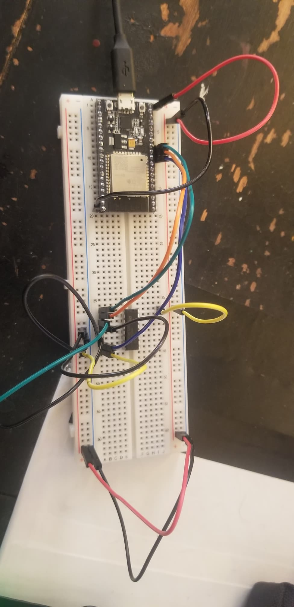
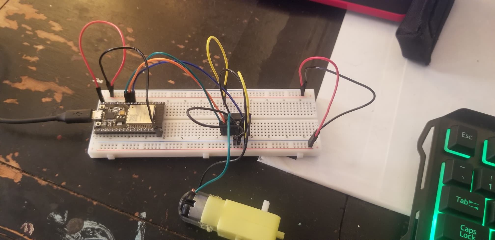
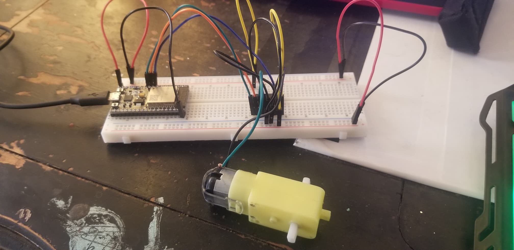
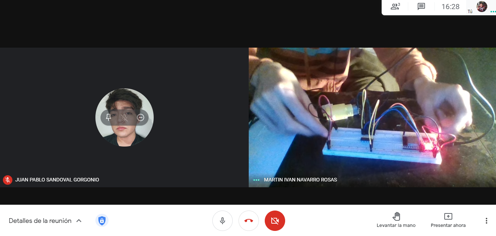
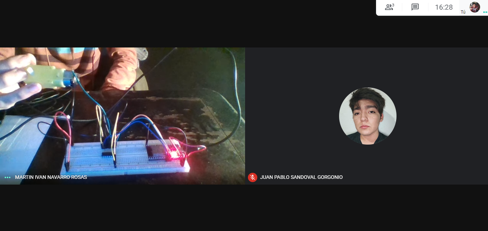
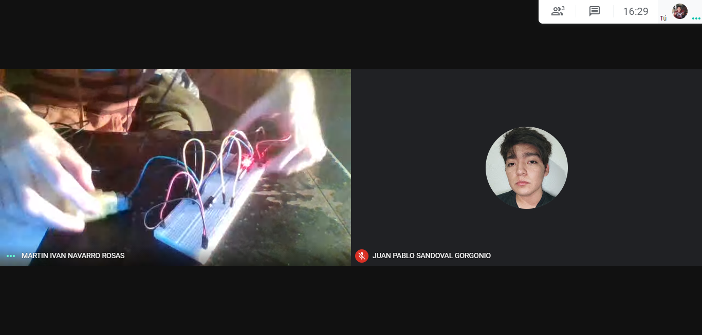
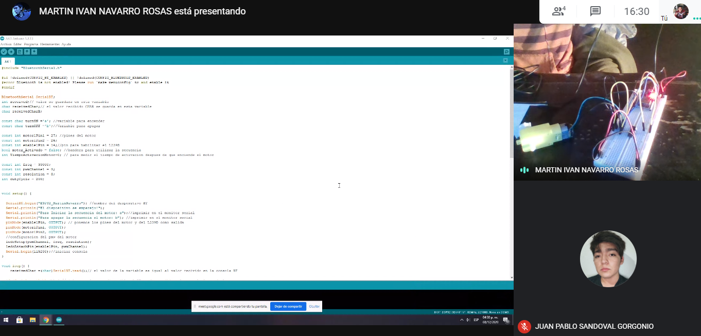

# :trophy: A4.1 Actividad de aprendizaje

Circuito de control para activar y desactivar un motor DC, utilizando  NodeMCU ESP32 por medio de Bluetooth
___

## Instrucciones

- Realizar un sistema ensamblado de control por medio de **Bluetooth**, capaz de control a un motor DC, utilizando un NodeMCU **ESP32**, un y un **IC L293D**.
- Toda actividad o reto se deberá realizar utilizando el estilo **MarkDown con extension .md** y el entorno de desarrollo VSCode, debiendo ser elaborado como un documento **single page**, es decir si el documento cuanta con imágenes, enlaces o cualquier documento externo debe ser accedido desde etiquetas y enlaces, y debe ser nombrado con la nomenclatura **A4.1_NombreApellido_Equipo.pdf.**
- Es requisito que el .md contenga una etiqueta del enlace al repositorio de su documento en GITHUB, por ejemplo **Enlace a mi GitHub** y al concluir el reto se deberá subir a github.
- Desde el archivo **.md** exporte un archivo **.pdf** que deberá subirse a classroom dentro de su apartado correspondiente, sirviendo como evidencia de su entrega, ya que siendo la plataforma **oficial** aquí se recibirá la calificación de su actividad.
- Considerando que el archivo .PDF, el cual fue obtenido desde archivo .MD, ambos deben ser idénticos.
- Su repositorio ademas de que debe contar con un archivo **readme**.md dentro de su directorio raíz, con la información como datos del estudiante, equipo de trabajo, materia, carrera, datos del asesor, e incluso logotipo o imágenes, debe tener un apartado de contenidos o indice, los cuales realmente son ligas o **enlaces a sus documentos .md**, _evite utilizar texto_ para indicar enlaces internos o externo.
- Se propone una estructura tal como esta indicada abajo, sin embargo puede utilizarse cualquier otra que le apoye para organizar su repositorio.
  
```
- readme.md
  - blog
    - C4.1_TituloActividad.md
    - C4.2_TituloActividad.md
    - C4.3_TituloActividad.md
    - C4.4_TituloActividad.md    
  - img
  - docs
    - A4.1_TituloActividad.md
    - A4.2_TituloActividad.md
    - A4.3_TituloActividad.md
```
___

### Fuentes de apoyo para desarrollar la actividad

- [x] [Random Nerd Tutorial DHT Humedad y temperatura](https://randomnerdtutorials.com/esp32-dht11-dht22-temperature-humidity-sensor-arduino-ide/)
- [x] [Motor DC con IC L293 y ESP32](https://www.hackster.io/Oniichan_is_ded/l293d-with-esp32-wemos-lolin-d32-v2-hacked-edition-ea2086)

___

## Desarrollo

1.Utilizar el siguiente listado de materiales para la elaboración de la actividad

| Cantidad | Descripción                                                  |
| -------- | -------------------------------------------------------------------------------------------------------------------------------------------------------------------------------------------------------------------------- |
| 1        | [IC L293D](https://hetpro-store.com/TUTORIALES/l293d/)             |
| 1        | [Fuente de voltaje de 5V](https://www.yescomusa.com/products/30v-precision-variable-voltage-power-supply-dc-converter)             |
| 1        | [NodeMCU ESP32](https://www.amazon.com.mx/ESP-32-ESP-32S-ESP-WROOM-32-ESP32-S-desarrollo/dp/B07TBFC75Z/ref=sr_1_2?__mk_es_MX=%C3%85M%C3%85%C5%BD%C3%95%C3%91&dchild=1&keywords=esp32&qid=1599003438&sr=8-2)                |
| 1        | [BreadBoard](https://www.amazon.com.mx/Deke-Home-Breadboard-distribuci%C3%B3n-electr%C3%B3nica/dp/B086C9HK7V/ref=sr_1_22?__mk_es_MX=%C3%85M%C3%85%C5%BD%C3%95%C3%91&dchild=1&keywords=breadboard&qid=1599003455&sr=8-22)   |
| 1        | [Jumpers M/M](https://www.amazon.com.mx/ELEGOO-Macho-Hembra-Macho-Macho-Hembra-Hembra-Protoboard/dp/B06ZXSQ5WG/ref=sr_1_1?__mk_es_MX=%C3%85M%C3%85%C5%BD%C3%95%C3%91&dchild=1&keywords=jumper+wires&qid=1599003519&sr=8-1) |
| 1| [Motor Reductor](https://www.steren.com.mx/motor-reductor-de-doble-eje-tipo-i-3-vcc.html) |

2. Basado en las imágenes que se muestran en las **Figura 1**, ensamblar un circuito electrónico, con la finalidad de obtener un sistema capaz de cumplir con las instrucciones siguientes:
   
  + Por medio de la aplicación "Serial Bluetooth terminal" que puede ser descargada del play Store de google o incluso cualquier otra que considere, se deberá controlar el arranque y apagado de un motor DC, es decir se contara con dos peticiones, la cual una de ellas representara el **"START" y la otra opción "STOP"**
  + El motor debe ser capaz de girar a favor de las manecillas del reloj durante 5 segundos, al cumplirse ese tiempo debe frenar 1 segundo e invertirá su giro durante otros 5 segundos, es decir la actividad debe tener la secuencia siguiente: El **stop** puede ser ejecutado en cualquier instante, y el motor estará ejecutando 5s en forward, 1s stop, 5s reverse, 1s stop, 5s forward, 1s stop, 5s reverse,...
    
<p align="center"> 
    <strong>Figura 1 Circuito ESP32 IC L293 Motor DC</strong>
    
</p>

3. Coloque aquí la imagen del circuito ensamblado

**CIRCUITO ENSAMBLADO**
<p align="center"> 
    
</p>

<p align="center"> 
    
</p>

<p align="center"> 
    
</p>

4. Coloque en este lugar el programa creado dentro del entorno de Arduino

**CODIGO** 
```C++

#include "BluetoothSerial.h"

#if !defined(CONFIG_BT_ENABLED) || !defined(CONFIG_BLUEDROID_ENABLED)
#error Bluetooth is not enabled! Please run make menuconfig to and enable it
#endif

BluetoothSerial SerialBT;
int received;// valor se guardara en esta variable
char receivedChar;// el valor recibido CHAR se guarda en esta variable 
char receivedCharB;

const char turnON ='a'; //variable para encender
const char turnOFF ='b';//Variable para apagar

const int motor1Pin1 = 27; //pines del motor
const int motor1Pin2 = 26;
const int enable1Pin = 14;//pin para habilitar el L239D
bool motor_Activado = false; //bandera para utilizar la secuencia
int TiempoActivacionMotor=0; // para medir el tiempo de activacion despues de que enciende el motor 

const int freq = 30000; 
const int pwmChannel = 0;
const int resolution = 8;
int dutyCycle = 200;


void setup() {
  
  SerialBT.begin("ESP32_MartinNavarro"); //nombre del dispositivo BT
  Serial.println("El dispositivo se emparejo!");
  Serial.println("Para Iniciar la secuencia del motor: a");//imprimir en el monitor serial
  Serial.println("Para apagar la secuencia el motor: b"); //imprimir en el monitor serial  
  pinMode(enable1Pin, OUTPUT); // ponemos los pines del motor y del L239D como salida
  pinMode(motor1Pin1, OUTPUT);
  pinMode(motor1Pin2, OUTPUT);
  //configuracion del pwm del motor
  ledcSetup(pwmChannel, freq, resolution);
  ledcAttachPin(enable1Pin, pwmChannel);
  Serial.begin(115200);//iniciar consola
}

void loop() {
    receivedChar =(char)SerialBT.read();// el valor de la variable es igual al valor recibido en la consola BT

  if (Serial.available()) { //si la consola esta disponible el BT puede escribir y la consola lo puede leer 
    SerialBT.write(Serial.read());
  }
  
  if (SerialBT.available()) { 
    SerialBT.print("Recibido:");// Escribir en BT app
    SerialBT.println(receivedChar);// Escribir en BT app      
    Serial.print ("Recibido:");//imprimir en el monitor serial
    Serial.println(receivedChar);//imprimir en el monitor serial    
    
    if(receivedChar == turnON)iniciarSecuencia(); // si el caracter que se envia es igual a la variable "turnON" inciar la secuencia del motor
    else if (receivedChar == turnOFF) detenerSecuencia(); // si el caracter que se envia es igual a la variablw "turnOFF" detener la secuencia del motor
  }
if (motor_Activado) control_De_Secuencia();
}   

//Iniciar la secuencia
void iniciarSecuencia(){
  TiempoActivacionMotor = millis();
  motor_Activado=true; 
  }

  //detener la secuencia
  void detenerSecuencia(){
   DetenerMotor();
   motor_Activado=false;
  }

 //secuencia del motor 
void control_De_Secuencia(){
  int tiempoTranscurrido= millis() - TiempoActivacionMotor; //El tiempo transcurrido es igual a la del tiempo de activacion del motor 
  if(tiempoTranscurrido < 5000) motorEncendido(); // Encender el motor durante 5 segundos 
  else if(tiempoTranscurrido < 6000) DetenerMotor(); // Apagar el motor despues de los 5 segundos
  else if(tiempoTranscurrido < 11000) MotorReversa();// Encender el motor en reversa otros 5 seguntos
  else if(tiempoTranscurrido < 12000) DetenerMotor(); // Detener el motor
  else iniciarSecuencia(); //Reiniciar la secuencia 
}


  void motorEncendido(){
  dutyCycle = 255;
  ledcWrite(pwmChannel, dutyCycle);  
  Serial.println("Motor hacia delante");
  digitalWrite(motor1Pin1, LOW);
  digitalWrite(motor1Pin2, HIGH); 
  }

  // para mover motor hacia atras
  void MotorReversa(){
  Serial.println("El motor se mueve hacia atras");
  digitalWrite(motor1Pin1, HIGH);
  digitalWrite(motor1Pin2, LOW); 
  }
 
  void DetenerMotor(){
  Serial.println("el motor se detuvo");
  digitalWrite(motor1Pin1, LOW);
  digitalWrite(motor1Pin2, LOW);
    }

```

5. Coloque aquí evidencias que considere importantes durante el desarrollo de la actividad.

**FUNCIONAMIENTO**

:arrow_forward: [**VIDEO DE LA ACTIVIDAD**](https://youtu.be/iNOVoV5sTQQ)


<p align="center"> 
    
</p>

<p align="center"> 
    
</p>

<p align="center"> 
    
</p>

<p align="center"> 
    
</p>

6. Incluya las **conclusiones** individuales y resultados observados durante el desarrollo de la actividad.

- **Hernández Quezada Martín**

En esta actividad conocimos un poco mas sobre las funcionalidades del ESP32, como lo es en esta ocasión el Bluetooth donde enviábamos el código de Arduino por el Bluetooth del ESP32 para que este en el circuito encendiera el motor y girara dependiendo de las condiciones que se pidieron, el motor encendía y apagaba dependiendo de lo que se le indicara por medio del Bluetooth, se tuvo un poco de complejidad al momento de hacer que funcionara ya que nuestro código no funcionaba hasta que se le agregaron los métodos necesarios que hicieron que este funcionara. 

- **Navarro Rosas Martín Ivan**

En esta practica pudimos aprender mucho acerca de la programación del ESP32 asi como interactuar mediante Bluetooth con el microcontrolador, el motor que utilizamos es un motor reductor, en base a lo que hicimos en esta practica se podria desarrollar algun carrito que sea controlado por este microcontrolador o múltiples aplicaciones no solo un carrito , el esp 32 realmente nos proporciona demasiadas herramientas, sin embargo requiere mucha practica y conocimiento para poder aplicar lo que se requiere, esta practica fue muy complicado a la hora de programar la secuencia , debido a que intentamos hacerlo sin métodos, por lo que al principio solo hacia la secuencia una vez , despues intentamos con un ciclo while pero este no podia salir de la secuencia, es por eso que recurrimos a la funcion de "millis" y realizar los metodos por separado y de esta manera si pudimos hacerlo funcionar.

- **Sandoval Gorgonio Juan Pablo** 

En esta practica aprendimos como realizar una conexión entre el esp32 y un motor DC mediante bluetooth desde la aplicación para celular, se nos dificultó en la parte del código ya que no funciono realizándolo sin métodos. 
Me pareció interesante esta práctica ya que te da la idea de como realizar un carrito o al menos como los realizan, aunque se pueden realizar diferentes practicas no solo eso.

___

### :bomb: Rubrica

| Criterios     | Descripción                                                                                  | Puntaje |
| ------------- | -------------------------------------------------------------------------------------------- | ------- |
| Instrucciones | Se cumple con cada uno de los puntos indicados dentro del apartado Instrucciones?            | 10      |
| Desarrollo    | Se respondió a cada uno de los puntos solicitados dentro del desarrollo de la actividad?     | 60      |
| Demostración  | El alumno se presenta durante la explicación de la funcionalidad de la actividad?            | 20      |
| Conclusiones  | Se incluye una opinión personal de la actividad  por cada uno de los integrantes del equipo? | 10      |


**Repositorios**

:house: [**Repositorio - HERNANDEZ QUEZADA MARTIN**](https://github.com/MartinHQ23/SistemasProgramables)

:house: [**Repositorio - NAVARRO ROSAS MARTIN IVAN**](https://github.com/MartinNavarro17/REPOSITORIO-SISTEMAS-PROGRAMABLES)

:house: [**Repositorio - SANDOVAL GORGONIO JUAN PABLO**](https://github.com/JuanPSG/SistemasProgramables)