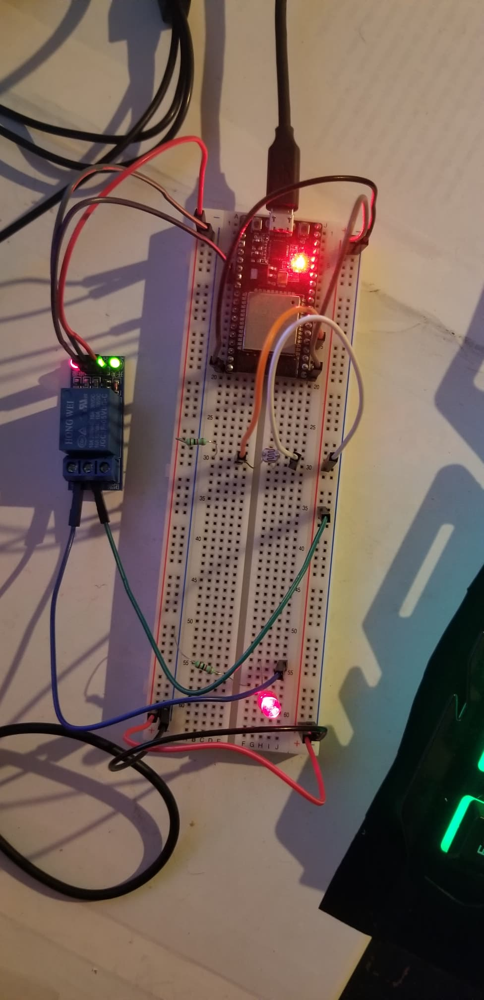

# :trophy: A4.2 Actividad de aprendizaje

Circuito sensor de iluminación y actuación de luz NodeMCU ESP32 por medio de Wi-Fi
___

## Instrucciones

- Realizar un sistema de medición y actuación de luz ambiental, utilizando el protocolo de comunicación **Wi-FI**, asi como un NodeMCU **ESP32**, un sensor  **LDR**, un diodo LED.
- Toda actividad o reto se deberá realizar utilizando el estilo **MarkDown con extension .md** y el entorno de desarrollo VSCode, debiendo ser elaborado como un documento **single page**, es decir si el documento cuanta con imágenes, enlaces o cualquier documento externo debe ser accedido desde etiquetas y enlaces, y debe ser nombrado con la nomenclatura **A4.2_NombreApellido_Equipo.pdf.**
- Es requisito que el .md contenga una etiqueta del enlace al repositorio de su documento en GITHUB, por ejemplo **Enlace a mi GitHub** y al concluir el reto se deberá subir a github.
- Desde el archivo **.md** exporte un archivo **.pdf** que deberá subirse a classroom dentro de su apartado correspondiente, sirviendo como evidencia de su entrega, ya que siendo la plataforma **oficial** aquí se recibirá la calificación de su actividad.
- Considerando que el archivo .PDF, el cual fue obtenido desde archivo .MD, ambos deben ser idénticos.
- Su repositorio ademas de que debe contar con un archivo **readme**.md dentro de su directorio raíz, con la información como datos del estudiante, equipo de trabajo, materia, carrera, datos del asesor, e incluso logotipo o imágenes, debe tener un apartado de contenidos o indice, los cuales realmente son ligas o **enlaces a sus documentos .md**, _evite utilizar texto_ para indicar enlaces internos o externo.
- Se propone una estructura tal como esta indicada abajo, sin embargo puede utilizarse cualquier otra que le apoye para organizar su repositorio.
  
```
- readme.md
  - blog
    - C4.1_TituloActividad.md
    - C4.2_TituloActividad.md
    - C4.3_TituloActividad.md
    - C4.4_TituloActividad.md    
  - img
  - docs
    - A4.1_TituloActividad.md
    - A4.2_TituloActividad.md
    - A4.3_TituloActividad.md
```
___

### Fuentes de apoyo para desarrollar la actividad

   - [x] [ESP32 Web Server](https://randomnerdtutorials.com/esp32-web-server-arduino-ide/)
   - [x] [LDR con ESP32](https://www.youtube.com/watch?v=A3qcN2mzv0Q)
   
___

## Desarrollo

1.Utilizar el siguiente listado de materiales para la elaboración de la actividad

| Cantidad | Descripción    |
| -------- | -------------- |
| 1        | [Modulo Sensor LDR]([https://articulo.mercadolibre.com.mx/MLM-623282168-modulo-sensor-de-luz-ldr-_JM)             |
| 1 | [Rele de 3.3v](https://articulo.mercadolibre.com.mx/MLM-743613781-modulo-relevador-de-5v-para-arduino-relay-1-canal-_JM) |
| 1 | [Bombilla](https://www.steren.com.mx/foco-led-de-luz-calida-9-w.html)  |
| 1        | [Fuente de voltaje de 5V](https://www.yescomusa.com/products/30v-precision-variable-voltage-power-supply-dc-converter)                                                 |
| 1        | [NodeMCU ESP32](https://www.amazon.com.mx/ESP-32-ESP-32S-ESP-WROOM-32-ESP32-S-desarrollo/dp/B07TBFC75Z/ref=sr_1_2?__mk_es_MX=%C3%85M%C3%85%C5%BD%C3%95%C3%91&dchild=1&keywords=esp32&qid=1599003438&sr=8-2)                |
| 1        | [BreadBoard](https://www.amazon.com.mx/Deke-Home-Breadboard-distribuci%C3%B3n-electr%C3%B3nica/dp/B086C9HK7V/ref=sr_1_22?__mk_es_MX=%C3%85M%C3%85%C5%BD%C3%95%C3%91&dchild=1&keywords=breadboard&qid=1599003455&sr=8-22)   |
| 1        | [Jumpers M/M](https://www.amazon.com.mx/ELEGOO-Macho-Hembra-Macho-Macho-Hembra-Hembra-Protoboard/dp/B06ZXSQ5WG/ref=sr_1_1?__mk_es_MX=%C3%85M%C3%85%C5%BD%C3%95%C3%91&dchild=1&keywords=jumper+wires&qid=1599003519&sr=8-1) |

2. Basado en la imágen que se muestran en las **Figura 1**, ensamble un circuito electrónico y agregue un Led y un rele a una de las terminales del dispositivo, de tal manera que se pueda obtener un sistema capaz de cumplir con las instrucciones siguiente:
    - Se deberá utilizar el NodeMCU como un **standalone Web server**, el cual deberá proveer una interface visual, que mostrara una imagen representando un comportamiento de "ON y OFF" dependiendo de la condición de iluminación ambiental.
    - El sensor de iluminación deberá estar midiendo la cantidad de luz que existen en el ambiente.
    - Al momento de detectar el sensor LDR, ausencia de luz deberá mostrar en la interface Web un estado "ON", y en caso contrario deberá representarse el estado "OFF".
    - Al circuito de la figura 1 se le deberá agregar un relevador en serie con una bombilla, que sera activada en condición opuesta al estado "ON" y "OFF", es decir una vez que el sensor detecto poca o nula iluminación activara el rele y por consecuencia encenderá la bombilla, y en caso contrario lo apagara.

[Fuente de apoyo Random Nerd Tutorial](https://randomnerdtutorials.com/esp32-web-server-arduino-ide/)
    
<p align="center"> 
    <strong>Figura 1 Circuito ESP32 Sensor LDR iluminacion</strong>
    
</p>

3. Coloque aquí la imagen del circuito ensamblado
<p align="center"> 
    
</p>

<p align="center"> 
    
</p>

<p align="center"> 
    
</p>


1. Coloque en este lugar el programa creado dentro del entorno de Arduino

```C++
#include <WiFi.h>
#include <WebServer.h>
#include <AsyncTCP.h>
#include <ESPAsyncWebServer.h>

//para que el esp se conecte a la red
const char* ssid = "INFINITUMqs32";
const char* password = "6646821349";

 // Servidor web asíncrono
AsyncWebServer server(80);    
 // Websocket
AsyncWebSocket websocket("/ws"); 
//Pines para el relay y el el sensor
const int sensorPin = 34; 
const int relayPin = 16; 
 // variables de Nivel de luz del sensor 
static int light_level=0;        
//Estado previo del led y estado actual   
static bool led_on_previous = false; 
static bool led_on = false;          

// Código HTML y JS para LED encendido
const char ON_HTML[] PROGMEM = R"rawliteral(
<!DOCTYPE html>
<html>
  <body style="background-color:red;color:white;">
    <h1>LED PRENDIDO</h1>
    <script>
      const websocket = new WebSocket("ws://" + window.location.host + "/ws");
      websocket.addEventListener("open", _ => {console.log("WEBSOCKET CONECTADO");});
      websocket.addEventListener("message", _ => {location.reload();});
    </script>
  </body>
</html>
)rawliteral";

// Código HTML y JS para LED apagado
const char OFF_HTML[] PROGMEM = R"rawliteral(
<!DOCTYPE html>
<html>
  <body>
    <h1>LED APAGADO</h1>
    <script>
      const websocket = new WebSocket("ws://" + window.location.host + "/ws");
      websocket.addEventListener("open", _ => {console.log("WEBSOCKET CONECTADO");});
      websocket.addEventListener("message", _ => {location.reload();});
    </script>
  </body>
</html>
)rawliteral";

// Función para cambiar el estado del LED
void handle_led_change() {
  if (led_on) digitalWrite(relayPin, LOW);
  else digitalWrite(relayPin, HIGH);
  led_on_previous = led_on;
  websocket.textAll("CHANGE"); // Al cambiar el estado del LED se manda cualquier mesaje y el websocket recarga la página
}
/* El servidor web tiene que utilizar un pre-procesador,este no sirve para nada pero se debe utilizar */
String processor(const String& var) {}
void setup() {
  pinMode(relayPin, INPUT); // Activar pin para sensor
  pinMode(relayPin, OUTPUT); // Activar pin para relay
  Serial.begin(115200); // Iniciar consola serial
  WiFi.begin(ssid, password); // Conectar a wi-fi
  while (WiFi.status() != WL_CONNECTED) {
    delay(1000);
    Serial.print(".");
  }
  Serial.println("");
  Serial.println("Conectado a la red.");
  Serial.print("Dirección IP: ");
  Serial.println(WiFi.localIP());
  server.on("/", HTTP_GET, [](AsyncWebServerRequest *req){
    req->send_P(200, "text/html", led_on ? ON_HTML : OFF_HTML, processor);
  });
  server.addHandler(&websocket);
  server.begin();
  Serial.println("Servidor HTTP activo.");
  delay(1000);
}
void loop() {
  websocket.cleanupClients();
  light_level = analogRead(sensorPin);
  if (light_level <= 500  ) led_on = true;
  else led_on = false;
  if (led_on != led_on_previous) handle_led_change();
  delay(1000);

}
```

5. Coloque aquí evidencias que considere importantes durante el desarrollo de la actividad.

:arrow_forward: [**VIDEO DE LA ACTIVIDAD**](https://youtu.be/57tR77Zt9BY)

**FUNCIONAMIENTO**
<p align="center"> 
    
</p>

<p align="center"> 
    
</p>

<p align="center"> 
    
</p>

**REUNION MEET**
<p align="center"> 
    
</p>

<p align="center"> 
    
</p>

<p align="center"> 
    
</p>

<p align="center"> 
    
</p>

<p align="center"> 
    
</p>

6. Incluya las **conclusiones** individuales y resultados observados durante el desarrollo de la actividad.

- **Hernández Quezada Martín**

Esta actividad nos pedía encender/apagar un LED dependiendo de la condición de luz en el ambiente, esto se mostraría en una Interfaz web la cual mostraría ENCENDIDO/APAGADO, esto gracias al ESP32 y su tecnología WiFi.
Hasta ahora esta es la practica que mas se nos ha dificultado al ser algo mas complejo y donde se pide la utilización de mas materiales, además de incorporar HTML y CSS, lo cual es bastante interesante que pueden ser utilizados de una forma mas fácil mediante el Arduino IDE y las librerías externas que nos podrían ser bastante útiles a futuro. 

- **Navarro Rosas Martín Ivan**

Esta practica fue la mas difícil que hemos realizado desde el inicio del curso , debido a que se utilizan diferentes componentes, asi como programación HTML , por lo que no es nuestro fuerte, pero pudimos realizar la practica y comprender como funciona el HTML, asi como el funcionamiento analógico del  sensor de luz, que este puede tener diversos usos muy utiles, en este caso lo utilizamos para prender un led, esta practica requiere de librerías externas y por lo tanto también aprendimos a instalarlas.

- **Sandoval Gorgonio Juan Pablo** 

En esta actividad teníamos que encender y apagar un led dependiendo de la cantidad de luz que exista alrededor del sensor de luz. Me parece interesante ya que este tipo de practicas nos demuestra como funcionan algunos circuitos que se integran ya sea en casas o lugares públicos, además de aprender como enlazar dicha practica a una pagina web.
___

### :bomb: Rubrica

| Criterios     | Descripción                                                                                  | Puntaje |
| ------------- | -------------------------------------------------------------------------------------------- | ------- |
| Instrucciones | Se cumple con cada uno de los puntos indicados dentro del apartado Instrucciones?            | 10      |
| Desarrollo    | Se respondió a cada uno de los puntos solicitados dentro del desarrollo de la actividad?     | 60      |
| Demostración  | El alumno se presenta durante la explicación de la funcionalidad de la actividad?            | 20      |
| Conclusiones  | Se incluye una opinión personal de la actividad  por cada uno de los integrantes del equipo? | 10      |


**Repositorios**

:house: [**Repositorio - HERNANDEZ QUEZADA MARTIN**](https://github.com/MartinHQ23/SistemasProgramables)

:house: [**Repositorio - NAVARRO ROSAS MARTIN IVAN**](https://github.com/MartinNavarro17/REPOSITORIO-SISTEMAS-PROGRAMABLES)

:house: [**Repositorio - SANDOVAL GORGONIO JUAN PABLO**](https://github.com/JuanPSG/SistemasProgramables)