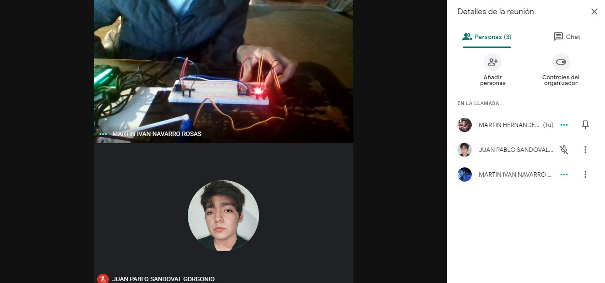

# :trophy: A5.1 Actividad de aprendizaje

Sistema sensor y actuacion del color de un objeto, e interface visual
___

## Instrucciones

- Realizar un sistema de identificacion de color utilizando un sensor de RGB TCS34725, un nodeMCU ESP32, un actuador Servomotor SG90, cualquier protocolo de comunicación y una interface visual que puede ser desarrollada por el equipo o apoyandose de otras como Node-red por ejemplo.
- Toda actividad o reto se deberá realizar utilizando el estilo **MarkDown con extension .md** y el entorno de desarrollo VSCode, debiendo ser elaborado como un documento **single page**, es decir si el documento cuanta con imágenes, enlaces o cualquier documento externo debe ser accedido desde etiquetas y enlaces, y debe ser nombrado con la nomenclatura **A5.2_NombreApellido_Equipo.pdf.**
- Es requisito que el .md contenga una etiqueta del enlace al repositorio de su documento en GITHUB, por ejemplo **Enlace a mi GitHub** y al concluir el reto se deberá subir a github.
- Desde el archivo **.md** exporte un archivo **.pdf** que deberá subirse a classroom dentro de su apartado correspondiente, sirviendo como evidencia de su entrega, ya que siendo la plataforma **oficial** aquí se recibirá la calificación de su actividad.
- Considerando que el archivo .PDF, el cual fue obtenido desde archivo .MD, ambos deben ser idénticos.
- Su repositorio ademas de que debe contar con un archivo **readme**.md dentro de su directorio raíz, con la información como datos del estudiante, equipo de trabajo, materia, carrera, datos del asesor, e incluso logotipo o imágenes, debe tener un apartado de contenidos o indice, los cuales realmente son ligas o **enlaces a sus documentos .md**, _evite utilizar texto_ para indicar enlaces internos o externo.
- Se propone una estructura tal como esta indicada abajo, sin embargo puede utilizarse cualquier otra que le apoye para organizar su repositorio.
  
```
- readme.md
  - blog
    - C5.1_TituloActividad.md
    - C5.2_TituloActividad.md    
  - img
  - docs
    - A5.1_TituloActividad.md
    - A5.2_TituloActividad.md    
```

___

## Desarrollo

1. Utilizar el siguiente listado de materiales para la elaboración de la actividad

| Cantidad | Descripción    |
| -------- | -------------- |
| 1        | [Sensor RGB TCS34725](https://www.cetronic.es/sqlcommerce/disenos/plantilla1/seccion/producto/DetalleProducto.jsp?idIdioma=&idTienda=93&codProducto=888304046&cPath=1343) |
| 1 | [Servomotor SG90](https://articulo.mercadolibre.com.mx/MLM-585222055-servomotor-micro-sg90-arduino-pic-raspberry-_JM#position=1&type=item&tracking_id=648fd038-498c-4d09-a4f7-7cd542db49b7)  |
| 1        | [Fuente de voltaje de 5V](https://www.steren.com.mx/cable-usb-a-mini-usb-de-1-8-m.html)|
| 1        | [NodeMCU ESP32](https://www.amazon.com.mx/ESP-32-ESP-32S-ESP-WROOM-32-ESP32-S-desarrollo/dp/B07TBFC75Z/ref=sr_1_2?__mk_es_MX=%C3%85M%C3%85%C5%BD%C3%95%C3%91&dchild=1&keywords=esp32&qid=1599003438&sr=8-2)                |
| 1        | [BreadBoard](https://www.amazon.com.mx/Deke-Home-Breadboard-distribuci%C3%B3n-electr%C3%B3nica/dp/B086C9HK7V/ref=sr_1_22?__mk_es_MX=%C3%85M%C3%85%C5%BD%C3%95%C3%91&dchild=1&keywords=breadboard&qid=1599003455&sr=8-22)   |
| 1        | [Jumpers M/M](https://www.amazon.com.mx/ELEGOO-Macho-Hembra-Macho-Macho-Hembra-Hembra-Protoboard/dp/B06ZXSQ5WG/ref=sr_1_1?__mk_es_MX=%C3%85M%C3%85%C5%BD%C3%95%C3%91&dchild=1&keywords=jumper+wires&qid=1599003519&sr=8-1) |

2. Basado en las imágenes que se muestran en las **Figura 1**, realizar un sistema capaz de cumplir con las siguientes condiciones:
   
   - La primer fase de la actividad consistira en, al colocar un objeto frente al sensor RGB, este debera identificar que color tiene (es recomendable utiizar objetos de color Rojo, Verde, y Azul para mayor precision), el cual debera mostrar en un interface visual que color fue detectado.
   - La segunda fase, consistira en agregar un actuador que y un identificador de color apoyandose de una banda de colores como se muestra en la imagen 1; al conocer el color del objeto el actuador debera apuntar al color que se esta detectando.

 <p align="center"> 
    <strong>Figura 1 Circuito ESP32 Sensor de color y Servomotor</strong>
    
</p>

3. Coloque aquí la imagen del circuito ensamblado

**CIRCUITO ENSAMBLADO**

<p align="center"> 
    
</p>

<p align="center"> 
    
</p>

<p align="center"> 
    
</p>

4. Coloque en este lugar el programa creado dentro del entorno de Arduino

**CODIGO**
```C++
#include "Adafruit_TCS34725.h"
#include <Wire.h>
#include <Servo.h>
#include <WiFi.h>
#include <WebServer.h>

// para conectarse por medio de WIFI
const char* ssid = "INFINITUMqs32";
const char* password = "6646821349";
WebServer server(80);

// Pines para protocolo I2C con sensor TCS34725
const byte I2C_SDA_PIN = 32;
const byte I2C_SCL_PIN = 33;

// Pin del motor
const byte MOTOR_PIN = 13;

// sensor TCS34725
Adafruit_TCS34725 tcs = Adafruit_TCS34725(TCS34725_INTEGRATIONTIME_700MS, TCS34725_GAIN_1X);

// servomotor
Servo servo;

// Variables para los colores recibidos.
float red, green, blue;

void setup() {
  // Iniciar consola serial
  Serial.begin(115200);
  // Control del motor
  servo.attach(MOTOR_PIN);
  // I2C
  Wire.begin(I2C_SDA_PIN, I2C_SCL_PIN);
  // Sensor
  Serial.println("Iniciando . . .");
  if (tcs.begin()) Serial.println("Sensor de color RGB Se ha activado!");
  else {
    Serial.println("No se puede encontrar el sensor de color RGB TCS34725 ...");
    while (true);
  }
  // Para iniciar conexion Wi-Fi
  WiFi.begin(ssid, password);
  Serial.print("Intentando conectar a: ");
  Serial.print(ssid);
  while (WiFi.status() != WL_CONNECTED) {
    delay(1000);
    Serial.print(".");
  }
  Serial.println("");
  Serial.print("Servidor listo!, Dirigite  a: ");
  Serial.println(WiFi.localIP());
  // HTTP server
  server.on("/", handle_root);
  server.begin();
  delay(100);
  Serial.println("Server iniciado!");
}
void loop() {
  tcs.getRGB(&red, &green, &blue);
  pick_color();
  server.handleClient();
}
// Función para decidir el color visto
void pick_color() { 
  if(red > green && red > blue) servo.write(135);
  else if (green > blue) servo.write(90);
  else servo.write(45);
}
void handle_root() {
  server.send(200, "application/json", "{\"red\": " + String((int)red) + ", \"green\": " + String((int)green) + ", \"blue\": " + String((int)blue) + "}");
}
```

5. Coloque aquí evidencias que considere importantes durante el desarrollo de la actividad.

:arrow_forward: [**VIDEO DE LA ACTIVIDAD FINAL**](https://youtu.be/gWXa_z_MtPc)

**INTERFAZ**
<p align="center"> 
    
</p>

**NODO RED**
<p align="center"> 
    
</p>

**CODIGO NODE**
```
[{"id":"f6f2187d.f17ca8","type":"tab","label":"Flow 1","disabled":false,"info":""},{"id":"1eab1382.257944","type":"http request","z":"f6f2187d.f17ca8","name":"","method":"GET","ret":"obj","paytoqs":"ignore","url":"192.168.1.75","tls":"","persist":false,"proxy":"","authType":"","x":430,"y":300,"wires":[["e45c198c.745e98","a653acb.f79e35","d5f1501a.d80ad8","edb69e87.5fc32"]]},{"id":"cbe892eb.7e65e8","type":"inject","z":"f6f2187d.f17ca8","name":"Repeat request","props":[],"repeat":"2","crontab":"","once":false,"onceDelay":0.1,"topic":"","x":230,"y":300,"wires":[["1eab1382.257944"]]},{"id":"e45c198c.745e98","type":"change","z":"f6f2187d.f17ca8","name":"Green","rules":[{"t":"set","p":"payload","pt":"msg","to":"payload.green","tot":"msg"}],"action":"","property":"","from":"","to":"","reg":false,"x":690,"y":280,"wires":[["15954cb2.9c79ab"]]},{"id":"a653acb.f79e35","type":"change","z":"f6f2187d.f17ca8","name":"Red","rules":[{"t":"set","p":"payload","pt":"msg","to":"payload.red","tot":"msg"}],"action":"","property":"","from":"","to":"","reg":false,"x":690,"y":220,"wires":[["b98438b1.0f0f1"]]},{"id":"d5f1501a.d80ad8","type":"change","z":"f6f2187d.f17ca8","name":"Blue","rules":[{"t":"set","p":"payload","pt":"msg","to":"payload.blue","tot":"msg"}],"action":"","property":"","from":"","to":"","reg":false,"x":690,"y":340,"wires":[["a18e2e9b.e0fb18"]]},{"id":"b98438b1.0f0f1","type":"ui_gauge","z":"f6f2187d.f17ca8","name":"","group":"fe5d2427.20272","order":0,"width":"2","height":"2","gtype":"gage","title":"Rojo","label":"","format":"{{value}}","min":0,"max":"255","colors":["#000000","#ff0000","#ff0000"],"seg1":"","seg2":"","x":910,"y":220,"wires":[]},{"id":"15954cb2.9c79ab","type":"ui_gauge","z":"f6f2187d.f17ca8","name":"","group":"fe5d2427.20272","order":0,"width":"2","height":"2","gtype":"gage","title":"Verde","label":"","format":"{{value}}","min":0,"max":"255","colors":["#000000","#00ff00","#00ff00"],"seg1":"","seg2":"","x":910,"y":280,"wires":[]},{"id":"a18e2e9b.e0fb18","type":"ui_gauge","z":"f6f2187d.f17ca8","name":"","group":"fe5d2427.20272","order":0,"width":"2","height":"2","gtype":"gage","title":"Azul","label":"","format":"{{value}}","min":0,"max":"255","colors":["#000000","#0000ff","#0000ff"],"seg1":"","seg2":"","x":910,"y":340,"wires":[]},{"id":"1396c89f.eac15f","type":"ui_colour_picker","z":"f6f2187d.f17ca8","name":"","label":"Color","group":"fe5d2427.20272","format":"hex","outformat":"string","showSwatch":false,"showPicker":true,"showValue":true,"showHue":true,"showAlpha":false,"showLightness":false,"square":"true","dynOutput":"false","order":0,"width":"6","height":"3","passthru":true,"topic":"","x":990,"y":460,"wires":[[]]},{"id":"edb69e87.5fc32","type":"template","z":"f6f2187d.f17ca8","name":"","field":"payload","fieldType":"msg","format":"handlebars","syntax":"mustache","template":"rgb({{payload.red}}, {{payload.green}}, {{payload.blue}})","output":"str","x":680,"y":460,"wires":[["622bb6eb.7fd2c8"]]},{"id":"622bb6eb.7fd2c8","type":"switch","z":"f6f2187d.f17ca8","name":"","property":"payload","propertyType":"msg","rules":[{"t":"neq","v":"rgb(, , )","vt":"str"}],"checkall":"true","repair":false,"outputs":1,"x":830,"y":460,"wires":[["1396c89f.eac15f"]]},{"id":"fe5d2427.20272","type":"ui_group","name":"Color","tab":"70fc2d5.8507854","order":1,"disp":true,"width":"6","collapse":false},{"id":"70fc2d5.8507854","type":"ui_tab","name":"Color","icon":"dashboard","disabled":false,"hidden":false}]
```

**EVIDENCIAS REUNIONES**
<p align="center"> 
    
</p>

<p align="center"> 
    
</p>

<p align="center"> 
    
</p>

<p align="center"> 
    
</p>

6. Para la demostracion de la actividad deberan utilizarse mas de un objeto para poder cubrir minimo tres colores.

**OBJETOS UTILIZADOS**
<p align="center"> 
    
</p>

7. Incluya las **conclusiones** individuales y resultados observados durante el desarrollo de la actividad.

- **Hernández Quezada Martín**

La practica final me pareció bastante interesante, donde se utilizo el sensor RGB para detectar los colores que se colocaban frente a el, aunque fue de las practicas mas complicadas que se realizaron, el haber cumplido con las practicas anteriores nos ayudaron a entender mejor esta practica y realizarla con éxito, donde las bibliotecas en el código fueron de gran ayuda para que nuestros sensores RGB y el servomotor sirvieran y pudieran realizar lo que se pedía en esta practica que fue de las mas complejas en el semestre.

- **Navarro Rosas Martín Ivan**

Esta practica realmente puso a prueba todos los conocimientos adquiridos a lo largo de todo este curso, por lo que la complejidad en esta practica es mas elevada, sin embargo es increible el potencial que tiene este microprocesador, se puede utilizar el motor para señalar objetos y el sensor practicamente puede detectar cualquier color que se le ponga en frente, de esta practica pudimos conocer mas bibliotecas, que realmente facilitan demasiado el proceso de programacion, y cada dia estas bibliotecas se van actualizando y nos falicitan el trabajo para poder realizar programas mas complejos.

- **Sandoval Gorgonio Juan Pablo** 

Esta práctica consistía en realizar un circuito donde el sensor RGB TCS34725 detectara que color se estaba colocando encima del sensor, y que servomotor SG90 indicara que color era. Fue una especie de combinación entre las practicas pasadas, ya que igual habíamos hecho uso de sensores o motores. Tuvimos que hacer uso de más bibliotecas para facilitar la parte de programación.

___

### :bomb: Rubrica

| Criterios     | Descripción                                                                                  | Puntaje |
| ------------- | -------------------------------------------------------------------------------------------- | ------- |
| Instrucciones | Se cumple con cada uno de los puntos indicados dentro del apartado Instrucciones?            | 10      |
| Desarrollo    | Se respondió a cada uno de los puntos solicitados dentro del desarrollo de la actividad?     | 60      |
| Demostración  | El alumno se presenta durante la explicación de la funcionalidad de la actividad?            | 20      |
| Conclusiones  | Se incluye una opinión personal de la actividad  por cada uno de los integrantes del equipo? | 10      |

**Repositorios**

:house: [**Repositorio - HERNANDEZ QUEZADA MARTIN**](https://github.com/MartinHQ23/SistemasProgramables)

:house: [**Repositorio - NAVARRO ROSAS MARTIN IVAN**](https://github.com/MartinNavarro17/REPOSITORIO-SISTEMAS-PROGRAMABLES)

:house: [**Repositorio - SANDOVAL GORGONIO JUAN PABLO**](https://github.com/JuanPSG/SistemasProgramables)